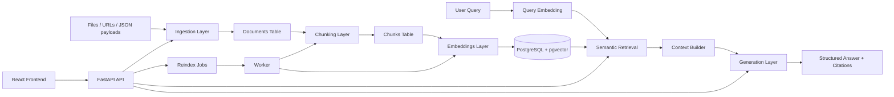

# RAG Decision Support System Plan V1

## Architecture

## Summary

- Backend: FastAPI with modular ingestion, chunking, embeddings, retrieval, generation, and indexing flows.
- Storage: PostgreSQL with `pgvector` support for production plus SQLite-compatible fallback for local tests.
- Providers: swappable `mock` and `openai` adapters for embeddings and generation.
- Frontend: React beta console for ingest, reindex, query, and document inspection.
- Infra: Docker Compose services for `api`, `worker`, `db`, and `frontend`.

## Implementation Scope

- Ingest `PDF`, `HTML`, `Markdown`, and `JSON` from file upload, URL, or direct payload.
- Normalize raw content and persist document metadata.
- Chunk documents with fixed and overlapping token strategies.
- Create and store embeddings per chunk.
- Reindex documents through explicit jobs, either inline or with a polling worker.
- Retrieve top-k relevant chunks with scores and metadata filtering.
- Generate grounded answers with citations tied to retrieved chunks.
- Expose REST endpoints for health, ingest, chunking, reindexing, querying, documents, and jobs.
- Provide a simple React UI for first beta testing.

## Public Interfaces

- `POST /ingest`
- `GET /health`
- `GET /documents`
- `GET /documents/{document_id}`
- `POST /documents/{document_id}/chunks`
- `GET /documents/{document_id}/chunks`
- `POST /reindex`
- `GET /jobs/{job_id}`
- `POST /query`

## Test and Acceptance

- Ingestion accepts supported file and payload inputs and persists metadata.
- Chunking respects token limits and overlap behavior.
- Reindex creates chunks plus embeddings and marks documents as indexed.
- Query returns a structured answer, citations, and trace metadata.
- Frontend builds successfully and connects to the API.

## Assumptions

- First beta defaults to `mock` providers so the stack runs without API keys.
- Production-like runs can switch to `openai` providers using environment variables.
- Streaming, reranking, caching, and evaluation metrics are left as follow-up enhancements after beta.
