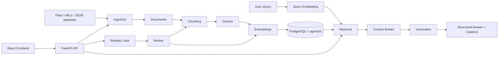

# Backoffice AI

Production-oriented first beta of a modular RAG decision support system.

Full project documentation is available in the [wiki](/home/roberto/rag-system/wiki/Home.md).
Detailed HTTP endpoint documentation with request and response examples is available in [wiki/API-Reference.md](/home/roberto/rag-system/wiki/API-Reference.md).
Technical design notes can live under [docs/](/home/roberto/rag-system/docs).

## Architecture



## What is included

- FastAPI backend bootstrap
- document ingestion for PDF, HTML, Markdown, and JSON
- PostgreSQL persistence for normalized raw documents
- token-based chunking with fixed and overlapping strategies
- mock or OpenAI embedding/generation providers
- reindex jobs with worker-compatible processing
- semantic retrieval and grounded query generation with citations
- metadata normalization for `category`, with fallback support for `domain` and `type`
- catalog-aware answer formatting for travel and activity content
- Markdown answer rendering plus optional structured machine output
- document and job inspection endpoints
- Alembic migrations with startup upgrade support
- source-based document upserts with versioning and stale-index reset
- `POST /ingest`
- `GET /health`
- `POST /auth/login`
- `GET /auth/me`
- `GET /auth/users`
- `POST /auth/users`
- `POST /documents/{id}/chunks`
- `GET /documents/{id}/chunks`
- `DELETE /documents/{id}`
- `POST /reindex`
- `POST /query`
- `GET /documents`
- `GET /documents/{id}`
- `GET /jobs/{id}`
- React frontend structured as a small routed web app
- Docker Compose services for `api`, `worker`, `db`, and `frontend`
- production frontend container served by Nginx, not the Vite dev server

## Run with Docker

Prerequisites for Docker builds:

- Docker Engine
- Docker Compose v2
- Docker Buildx

Verify:

```bash
docker --version
docker compose version
docker buildx version
```

```bash
cp .env.example .env
# edit .env and set POSTGRES_PASSWORD, AUTH_SECRET_KEY, and INITIAL_ADMIN_* before first start
docker compose up --build
```

Services:

- API: `http://localhost:8000`
- Frontend: `http://localhost:3000`
- PostgreSQL: internal to the Docker network by default

Frontend API resolution:

- by default the frontend calls the same host on port `8000`
- example: if you open `http://192.168.1.50:3000`, the frontend will call `http://192.168.1.50:8000`
- set `VITE_API_URL` only if your API is intentionally hosted on a different origin
- the backend only allows explicitly configured frontend origins
- for LAN/VPN access, add the exact frontend origin to `CORS_ORIGINS`, for example `["http://localhost:3000","http://192.168.1.50:3000"]`

Frontend container notes:

- the Docker `frontend` service now serves the built static app with Nginx
- the external URL remains `http://<host>:3000`
- local frontend development without Docker still uses `npm run dev`
- the frontend now uses routed views instead of a single long page
- main routes are:
  - `/`
  - `/dashboard`
  - `/ingestion`
  - `/search`
  - `/documents`
  - `/jobs`
  - `/settings`

By default the backend runs with deterministic `mock` providers so the stack works without external API keys.
To use OpenAI for real embeddings and generation, set:

```bash
export OPENAI_API_KEY=your_key
export EMBEDDING_PROVIDER=openai
export GENERATION_PROVIDER=openai
```

Optional:

```bash
export OPENAI_BASE_URL=https://api.openai.com/v1
```

You can also start from [`.env.example`](/home/roberto/rag-system/.env.example).

Database notes:

- PostgreSQL credentials are now environment-driven
- authentication is now required for all non-public app endpoints
- set `AUTH_SECRET_KEY`, `INITIAL_ADMIN_EMAIL`, and `INITIAL_ADMIN_PASSWORD` before first startup
- the bundled `db` service is not published on host port `5432` by default
- for admin access, use `docker compose exec db psql -U "$POSTGRES_USER" -d "$POSTGRES_DB"`
- add your server hostname or LAN IP to `TRUSTED_HOSTS` before remote use
- API docs are disabled by default; set `ENABLE_API_DOCS=true` temporarily if you need `/docs`
- ingest size limits are configurable with `MAX_UPLOAD_FILE_BYTES`, `MAX_INGEST_REQUEST_BYTES`, and `MAX_INGEST_JSON_BYTES`

## Migrations

The API container runs `alembic upgrade head` logic on startup by default.

Manual migration run:

```bash
cd backend
PYTHONPATH=. ../.venv/bin/alembic -c alembic.ini upgrade head
```

The worker defaults to `RUN_MIGRATIONS_ON_STARTUP=false` in Docker Compose to avoid migration races.

## Run locally without Docker

Backend:

```bash
python3 -m venv .venv
. .venv/bin/activate
pip install -r backend/requirements.txt
export DATABASE_URL=sqlite+pysqlite:///rag-system.db
export AUTH_SECRET_KEY=change-this-auth-secret
export INITIAL_ADMIN_EMAIL=admin@example.com
export INITIAL_ADMIN_PASSWORD=change-this-admin-password
cd backend
PYTHONPATH=. uvicorn app.main:app --reload
```

Frontend:

```bash
cd frontend
npm install
npm run dev
```

## Ingest examples

Upload a Markdown file:

```bash
curl -X POST http://localhost:8000/ingest \
  -F 'file=@sample.md' \
  -F 'metadata={"customer":"acme"}'
```

Send a JSON payload:

```bash
curl -X POST http://localhost:8000/ingest \
  -H 'Content-Type: application/json' \
  -d '{"payload":{"service":"audit","vat":25},"metadata":{"source":"api"}}'
```

Create chunks for an ingested document:

```bash
curl -X POST http://localhost:8000/documents/<document_id>/chunks \
  -H 'Content-Type: application/json' \
  -d '{"strategy":"overlap","chunk_size":512,"overlap_tokens":64}'
```

Create an indexing job and process it inline:

```bash
curl -X POST http://localhost:8000/reindex \
  -H 'Content-Type: application/json' \
  -d '{"document_id":"<document_id>","run_inline":true,"strategy":"overlap","chunk_size":512,"overlap_tokens":64}'
```

Delete a document:

```bash
curl -X DELETE http://localhost:8000/documents/<document_id>
```

Query indexed documents:

```bash
curl -X POST http://localhost:8000/query \
  -H 'Content-Type: application/json' \
  -d '{"query":"What VAT applies to consulting in Norway?","filters":{"country":"NO"}}'
```

Example response:

```json
{
  "answer": "## Answer\n\n- Norwegian VAT for consulting in Norway is 25 percent.",
  "sources": [
    {
      "document": "pricing-rules",
      "chunk": "2a6f...",
      "score": 0.74,
      "excerpt": "Norwegian VAT for consulting is 25 percent...",
      "metadata": {
        "country": "NO",
        "domain": "quotes",
        "category": "quotes"
      }
    }
  ],
  "trace": {
    "top_k": 5,
    "threshold": 0.2,
    "retrieval_count": 1,
    "retrieval_mode": "pgvector",
    "embedding_provider": "mock",
    "generation_provider": "mock"
  },
  "machine_output": null
}
```

For catalog and brochure questions, the generation layer can return richer Markdown plus a structured payload in `machine_output`. The visible `answer` is intended for users, while `machine_output` is intended for downstream integrations or validation.

## Frontend UX Notes

The current frontend is organized as a small internal web app:

- landing page at `/`
- dashboard overview at `/dashboard`
- dedicated ingestion workspace at `/ingestion`
- dedicated search workspace at `/search`
- corpus management at `/documents`
- job visibility at `/jobs`
- read-only runtime information at `/settings`

The search page is designed for non-technical internal users:

- one main question field
- `Category` and `Country` dropdown filters
- optional advanced retrieval controls
- staged loading animation during retrieval and generation
- Markdown answer rendering
- optional structured data panel when the backend returns `machine_output`

Metadata behavior:

- the backend normalizes `category`
- if uploaded metadata contains `domain` or `type`, the system maps that into `category`
- the frontend `Category` dropdown is populated automatically from ingested document metadata

## Token Usage and Cost

OpenAI cost starts when you:

- reindex documents
- run queries

Upload alone does not call OpenAI.

Current default models in this project:

- embeddings: `text-embedding-3-small`
- generation: `gpt-5-mini`

Pricing references:

- `text-embedding-3-small`: `$0.02 / 1M input tokens`
- `gpt-5-mini`: `$0.25 / 1M input tokens`, `$2.00 / 1M output tokens`

See:

- https://developers.openai.com/api/docs/models/text-embedding-3-small
- https://developers.openai.com/api/docs/models/gpt-5-mini
- https://developers.openai.com/api/docs/pricing

### Reindex cost

Reindexing embeds all chunks in a document.

Formula:

```text
embedding_cost = embedded_tokens / 1,000,000 * 0.02
```

Because the default chunking uses overlap (`512` chunk size, `64` overlap), embedding volume is usually about `14%` higher than raw document tokens.

Example:

- document size: `50,000` tokens
- estimated embedded tokens: `57,150`
- estimated cost: about `$0.00114`

### Query cost

A query uses:

- one query embedding
- one generation request

Formula:

```text
query_cost =
(query_embedding_tokens / 1,000,000 * 0.02)
+ (llm_input_tokens / 1,000,000 * 0.25)
+ (llm_output_tokens / 1,000,000 * 2.00)
```

Typical example:

- query embedding: `20` tokens
- generation input: `1,500` tokens
- generation output: `200` tokens

Estimated total:

```text
about $0.00078 per query
```

### Practical notes

- reindexing the same document again burns embedding cost again
- more retrieved context increases generation input cost
- longer answers increase generation output cost
- the app does not yet store token usage internally; use these formulas or the OpenAI usage dashboard for cost tracking

### Local cost calculator

You can estimate cost from the command line:

```bash
.venv/bin/python backend/scripts/cost_calculator.py index --document-tokens 50000
.venv/bin/python backend/scripts/cost_calculator.py query --input-tokens 1500 --output-tokens 200
```

## Project layout

```text
/backend
  /app
    /api
    /chunking
    /embeddings
    /generation
    /indexing
    /ingestion
    /retrieval
/frontend
/docker-compose.yml
/docs
```

## Document lifecycle

- `source_type + source_ref` is treated as the stable identity for a document.
- Re-ingesting the same source with unchanged content returns the same document unchanged.
- Re-ingesting the same source with changed content updates the existing document, increments `version`, clears stale chunks and embeddings, and marks the document as needing reindex.
- Reindex jobs are version-aware; stale jobs for older document versions are skipped.

## Local test run

```bash
cd backend
PYTHONPATH=. python -m unittest tests.test_ingestion tests.test_chunking tests.test_query tests.test_retrieval tests.test_lifecycle
```

Frontend build check:

```bash
cd frontend
npm run build
```
