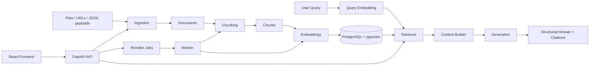

# RAG System

Production-oriented first beta of a modular RAG decision support system.

Full project documentation is available in the [wiki](/home/roberto/rag-system/wiki/Home.md).

## Architecture



## What is included

- FastAPI backend bootstrap
- document ingestion for PDF, HTML, Markdown, and JSON
- PostgreSQL persistence for normalized raw documents
- token-based chunking with fixed and overlapping strategies
- mock or OpenAI embedding/generation providers
- reindex jobs with worker-compatible processing
- semantic retrieval and grounded query generation with citations
- document and job inspection endpoints
- Alembic migrations with startup upgrade support
- source-based document upserts with versioning and stale-index reset
- `POST /ingest`
- `GET /health`
- `POST /documents/{id}/chunks`
- `GET /documents/{id}/chunks`
- `DELETE /documents/{id}`
- `POST /reindex`
- `POST /query`
- `GET /documents`
- `GET /documents/{id}`
- `GET /jobs/{id}`
- React frontend for ingest, reindex, query, and document inspection
- Docker Compose services for `api`, `worker`, `db`, and `frontend`

## Run with Docker

```bash
docker compose up --build
```

Services:

- API: `http://localhost:8000`
- Frontend: `http://localhost:3000`
- PostgreSQL: `localhost:5432`

Frontend API resolution:

- by default the frontend calls the same host on port `8000`
- example: if you open `http://192.168.1.50:3000`, the frontend will call `http://192.168.1.50:8000`
- set `VITE_API_URL` only if your API is intentionally hosted on a different origin
- the backend now accepts browser origins on port `3000` by default for LAN/VPN access; override with `CORS_ORIGINS` and `CORS_ORIGIN_REGEX` if needed

By default the backend runs with deterministic `mock` providers so the stack works without external API keys.
To use OpenAI for real embeddings and generation, set:

```bash
export OPENAI_API_KEY=your_key
export EMBEDDING_PROVIDER=openai
export GENERATION_PROVIDER=openai
```

Optional:

```bash
export OPENAI_BASE_URL=https://api.openai.com/v1
```

You can also start from [`.env.example`](/home/roberto/rag-system/.env.example).

## Migrations

The API container runs `alembic upgrade head` logic on startup by default.

Manual migration run:

```bash
cd backend
PYTHONPATH=. ../.venv/bin/alembic -c alembic.ini upgrade head
```

The worker defaults to `RUN_MIGRATIONS_ON_STARTUP=false` in Docker Compose to avoid migration races.

## Run locally without Docker

Backend:

```bash
python3 -m venv .venv
. .venv/bin/activate
pip install -r backend/requirements.txt
export DATABASE_URL=sqlite+pysqlite:///rag-system.db
cd backend
PYTHONPATH=. uvicorn app.main:app --reload
```

Frontend:

```bash
cd frontend
npm install
npm run dev
```

## Ingest examples

Upload a Markdown file:

```bash
curl -X POST http://localhost:8000/ingest \
  -F 'file=@sample.md' \
  -F 'metadata={"customer":"acme"}'
```

Send a JSON payload:

```bash
curl -X POST http://localhost:8000/ingest \
  -H 'Content-Type: application/json' \
  -d '{"payload":{"service":"audit","vat":25},"metadata":{"source":"api"}}'
```

Create chunks for an ingested document:

```bash
curl -X POST http://localhost:8000/documents/<document_id>/chunks \
  -H 'Content-Type: application/json' \
  -d '{"strategy":"overlap","chunk_size":512,"overlap_tokens":64}'
```

Create an indexing job and process it inline:

```bash
curl -X POST http://localhost:8000/reindex \
  -H 'Content-Type: application/json' \
  -d '{"document_id":"<document_id>","run_inline":true,"strategy":"overlap","chunk_size":512,"overlap_tokens":64}'
```

Delete a document:

```bash
curl -X DELETE http://localhost:8000/documents/<document_id>
```

Query indexed documents:

```bash
curl -X POST http://localhost:8000/query \
  -H 'Content-Type: application/json' \
  -d '{"query":"What VAT applies to consulting in Norway?","filters":{"country":"NO"}}'
```

Example response:

```json
{
  "answer": "Based on the indexed context: Norwegian VAT for consulting is 25 percent. [2a6f...]",
  "sources": [
    {
      "document": "pricing-rules",
      "chunk": "2a6f...",
      "score": 0.74,
      "excerpt": "Norwegian VAT for consulting is 25 percent...",
      "metadata": {
        "country": "NO",
        "domain": "quotes"
      }
    }
  ],
  "trace": {
    "top_k": 5,
    "threshold": 0.2,
    "retrieval_count": 1,
    "embedding_provider": "mock",
    "generation_provider": "mock"
  }
}
```

## Token Usage and Cost

OpenAI cost starts when you:

- reindex documents
- run queries

Upload alone does not call OpenAI.

Current default models in this project:

- embeddings: `text-embedding-3-small`
- generation: `gpt-5-mini`

Pricing references:

- `text-embedding-3-small`: `$0.02 / 1M input tokens`
- `gpt-5-mini`: `$0.25 / 1M input tokens`, `$2.00 / 1M output tokens`

See:

- https://developers.openai.com/api/docs/models/text-embedding-3-small
- https://developers.openai.com/api/docs/models/gpt-5-mini
- https://developers.openai.com/api/docs/pricing

### Reindex cost

Reindexing embeds all chunks in a document.

Formula:

```text
embedding_cost = embedded_tokens / 1,000,000 * 0.02
```

Because the default chunking uses overlap (`512` chunk size, `64` overlap), embedding volume is usually about `14%` higher than raw document tokens.

Example:

- document size: `50,000` tokens
- estimated embedded tokens: `57,150`
- estimated cost: about `$0.00114`

### Query cost

A query uses:

- one query embedding
- one generation request

Formula:

```text
query_cost =
(query_embedding_tokens / 1,000,000 * 0.02)
+ (llm_input_tokens / 1,000,000 * 0.25)
+ (llm_output_tokens / 1,000,000 * 2.00)
```

Typical example:

- query embedding: `20` tokens
- generation input: `1,500` tokens
- generation output: `200` tokens

Estimated total:

```text
about $0.00078 per query
```

### Practical notes

- reindexing the same document again burns embedding cost again
- more retrieved context increases generation input cost
- longer answers increase generation output cost
- the app does not yet store token usage internally; use these formulas or the OpenAI usage dashboard for cost tracking

### Local cost calculator

You can estimate cost from the command line:

```bash
.venv/bin/python backend/scripts/cost_calculator.py index --document-tokens 50000
.venv/bin/python backend/scripts/cost_calculator.py query --input-tokens 1500 --output-tokens 200
```

## Project layout

```text
/backend
  /app
    /api
    /chunking
    /embeddings
    /generation
    /indexing
    /ingestion
    /retrieval
/frontend
/docker-compose.yml
/PLANV1.md
```

## Document lifecycle

- `source_type + source_ref` is treated as the stable identity for a document.
- Re-ingesting the same source with unchanged content returns the same document unchanged.
- Re-ingesting the same source with changed content updates the existing document, increments `version`, clears stale chunks and embeddings, and marks the document as needing reindex.
- Reindex jobs are version-aware; stale jobs for older document versions are skipped.

## Local test run

```bash
cd backend
PYTHONPATH=. python -m unittest tests.test_ingestion tests.test_chunking tests.test_query tests.test_retrieval tests.test_lifecycle
```

Frontend build check:

```bash
cd frontend
npm run build
```
