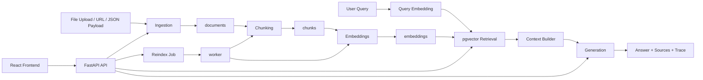

# Architecture

## Overview

The system is a modular RAG pipeline with four runtime services:

- `api`: FastAPI application
- `worker`: background indexing worker
- `db`: PostgreSQL with `pgvector`
- `frontend`: React/Vite web app served by Nginx in Docker

## Data Flow

## Frontend Architecture

The frontend is no longer a single long dashboard view. It is organized as:

- landing page at `/`
- routed workspace pages for dashboard, ingestion, search, documents, jobs, and settings
- shared app state and API actions in a central hook
- shell layout with sidebar navigation for workspace pages

## Backend Modules

### `ingestion`

Responsible for:

- detecting input type
- extracting text
- normalizing text
- normalizing metadata for downstream filtering
- upserting documents by source identity
- resetting stale index state when content changes

Supported inputs:

- multipart file upload
- HTML URL fetch
- direct JSON or text payload

Supported file formats:

- `PDF`
- `HTML`
- `Markdown`
- `JSON`

### `chunking`

Responsible for:

- splitting document text into token-based chunks
- storing chunk content and metadata
- clearing old embeddings when chunks are regenerated

Strategies:

- `fixed`
- `overlap`

Defaults:

- chunk size: `512`
- overlap: `64`

### `embeddings`

Responsible for:

- turning chunks into vectors
- storing one embedding per chunk

Supported providers:

- `mock`
- `openai`

### `retrieval`

Responsible for:

- embedding the query
- running similarity search
- applying metadata filters
- deduplicating repeated chunk results

Metadata filter behavior:

- canonical filter field: `category`
- compatibility aliases: `domain`, `type`
- `country` remains a direct filter when present

Runtime modes:

- `pgvector`: PostgreSQL cosine-distance query
- `python_fallback`: SQLite/local fallback for tests

### `generation`

Responsible for:

- building a grounded context window
- generating an answer
- selecting a response formatting mode
- returning human-readable Markdown
- optionally returning structured `machine_output`
- returning citation identifiers tied to retrieved chunks

Current response modes:

- `standard`: generic grounded answer formatting
- `activity_catalog`: stricter formatting for travel and activity catalog questions

Supported providers:

- `mock`
- `openai`

### `indexing`

Responsible for:

- creating reindex jobs
- processing jobs
- skipping stale jobs for outdated document versions

## Database Model

### `documents`

Core document record.

Important fields:

- `source_type`
- `source_ref`
- `content_hash`
- `version`
- `status`
- `metadata`
- `last_ingested_at`
- `last_indexed_at`
- `index_error`

Identity rule:

- `source_type + source_ref` is unique

### `chunks`

Stores chunked document text and chunk metadata.

### `embeddings`

Stores one vector per chunk.

### `index_jobs`

Stores asynchronous reindex jobs.

Important lifecycle field:

- `document_version`

### `query_logs`

Stores query text, answer text, and returned sources.

## Lifecycle Model

### Ingestion lifecycle

When the same source is re-ingested:

- unchanged content: no-op, same document version
- changed content: same document record, version incremented, chunks and embeddings cleared, document marked stale

Metadata normalization on ingest:

- if metadata contains `category`, it is preserved
- if metadata contains only `domain` or `type`, the system also derives `category`
- normalized metadata is returned in document summaries and query sources

### Index lifecycle

A document is considered stale when:

- `last_indexed_at` is null
- `last_indexed_at < last_ingested_at`
- `status != indexed`

### Job lifecycle

Job statuses can include:

- `pending`
- `running`
- `completed`
- `failed`
- `superseded`

## Configuration Model

Main settings come from environment variables:

- provider selection
- database connection
- model names
- chunking defaults
- retrieval thresholds
- migration startup behavior

See [Deployment Guide](./Deployment.md) for the full deployment matrix.
